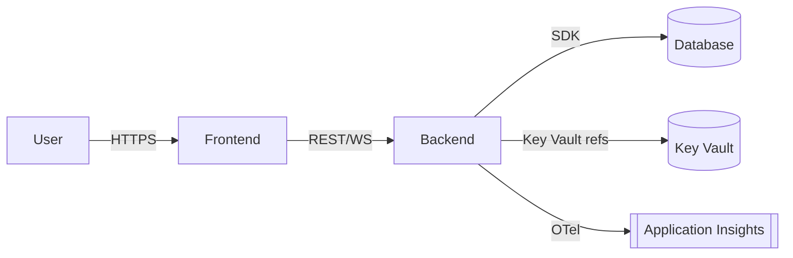

# {{workload}} — Architecture

{{description}}

## System overview

## Components

| Component | Technology | Responsibility |
|---|---|---|
| Frontend | Vite + React + MSAL | User interface |
| Backend | (functions / container-app) | Business logic, data access |
| Database | (Cosmos / SQL / Table) | Persistence |
| Secrets | Azure Key Vault | Runtime secret store |
| Observability | Application Insights + Log Analytics | Telemetry, logs, traces |

## Request flow

<TODO: replace with project-specific flow>

## Data flow

<TODO: replace with project-specific flow>

## Deployment

Per-environment: staging / prod. See `infra/README.md` for the deployment model.

## References

- [ADR Index](./adr/README.md)
- [Runbooks](./runbooks/README.md)
